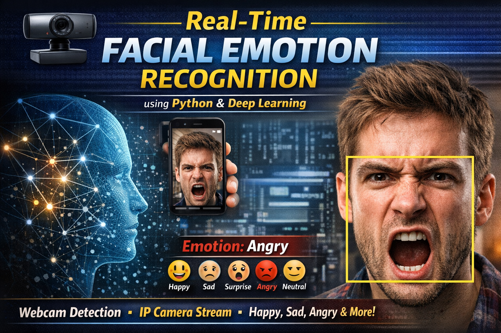

  

# Real-Time Facial Emotion Recognition using OpenCV

A real-time **Facial Emotion Recognition System** built using **Python, OpenCV, and Deep Learning**.  
This project detects human emotions from live video streams using either a **webcam** or a **mobile IP camera**.

The system analyzes facial expressions and classifies emotions such as **Happy, Sad, Angry, Surprise, Neutral**, etc.

---

## 🚀 Features

✔ Real-time emotion detection  
✔ Webcam-based emotion recognition  
✔ Mobile IP camera emotion recognition  
✔ Live IP camera streaming  
✔ Lightweight and easy to run  
✔ Built using OpenCV and Deep Learning

---

## 🧠 Technologies Used

- Python
- OpenCV
- NumPy
- Imutils
- Facial Emotion Recognition Library
- Computer Vision

---

## 📂 Project Structure
emotion-recognition-opencv/
│
├── webcam_emotion_detection.py
├── ip_camera_emotion_detection.py
├── ip_camera_stream.py
│
├── requirements.txt
└── README.md

---

## ⚙️ Installation

### 1️⃣ Clone the repository
https://github.com/selvan-01/real-time-emotion-recognition-opencv.git

2️⃣ Navigate to the project folder
cd emotion-recognition-opencv

3️⃣ Install required libraries
pip install -r requirements.txt

▶️ How to Run
📷 Webcam Emotion Detection
python webcam_emotion_detection.py

Uses your laptop webcam to detect emotions in real-time.

📱 Mobile IP Camera Emotion Detection

First install IP Webcam app on your mobile.

Then run:
python ip_camera_emotion_detection.py

Update the IP address inside the script:
url = 'http://YOUR\_PHONE\_IP:8080/shot.jpg'

Example:
url = 'http://192.168.1.33:8080/shot.jpg'

📡 IP Camera Stream Viewer
This script only displays the mobile camera stream.
python ip_camera_stream.py

📊 Example Use Cases
Emotion AI systems
Human behavior analysis
Smart surveillance
AI-based interaction systems
Computer vision research

🔮 Future Improvements
Emotion statistics dashboard
Emotion detection using deep neural networks
Real-time emotion logging
Face recognition integration
Web-based dashboard

## 🔗 Links

- 💼 [LinkedIn](https://www.linkedin.com/in/senthamil45)
- 🌍 [Portfolio](https://senthamill.vercel.app/)
- 💻 [GitHub](https://github.com/selvan-01/real-time-emotion-recognition-opencv.git)

👨‍💻 Author
S. Senthamil Selvan
Computer Science Engineer
AI | Data Analytics | Computer Vision
